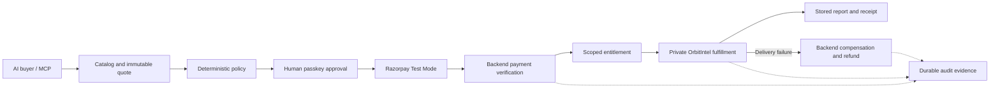

# MeterGate submission copy

Draft for the submission form. Add the verified repository and video links before submitting; no public deployment or video URL is claimed here.

## One-line pitch

MeterGate turns paid APIs into agent-readable purchases with bounded spending, human approval, Razorpay verification, scoped delivery, and recovery when fulfillment fails.

## Project description

AI agents can discover a paid API, but merchants still need a trustworthy path from interest to a completed purchase. MeterGate connects that journey: a machine-readable HTTP 402 challenge leads to an immutable server quote, deterministic spending checks, human passkey approval, Razorpay Test Mode Checkout, and a narrowly scoped entitlement.

The demo merchant, OrbitIntel, sells satellite information derived from current CelesTrak data. A successful purchase produces a readable report and a downloadable evidence receipt. Repeating the resource request retrieves the stored result. If delivery fails, backend compensation tracks refund progress while keeping historical payment and fulfillment states distinct.

The AI client interprets the request and proposes a service through ten narrow MCP tools. It cannot change prices, override policy, approve itself, declare a payment successful, or authorize refunds. Every sensitive transition leaves inspectable evidence.

This is a working Razorpay Test Mode prototype. The merchant integration contract is documented; a published SDK, self-service onboarding, and unattended live-money purchasing are future work.

## Evidence available for judges

- September 5 browser acceptance: actual human approval, ₹5 capture, CelesTrak-backed report, inspected receipt, and stored-result replay with one execution attempt.
- September 5 browser denial: ₹9 quote rejected under ₹5; zero linked approvals or payment transactions.
- Recorded deterministic policy matrix: 60/60 cases passed. This is a policy benchmark, not an LLM reasoning or prompt-injection benchmark.
- August 26 historical Razorpay Test Mode acceptance: ₹5 refund reached provider status `processed`. Its measured 18.27 seconds covers refund request to completion.
- Automated validation: 795 backend tests passed, 2 skipped; live Razorpay test files excluded. Frontend data/contract tests, production build, and typecheck passed. See the readiness record for full scopes.

Fresh connected-agent selection and failure/refund recording remain pending. Do not replace this sentence with a success claim until observed and recorded in the agent-run evidence.

## Architecture for the final slide

Stack: Next.js/TypeScript, FastAPI/Python, PostgreSQL, Redis, Razorpay Test Mode, WebAuthn, MCP, and a separate OrbitIntel service.

## Final form fields to complete

- Public repository URL: verify the submitted revision includes intended new files.
- Video URL: verify signed-out playback and the event's duration limit.
- Demo URL, if provided: verify the exact host and account/passkey setup.
- Team details and submission confirmation: complete in the official form.

Use [presentation.md](presentation.md) for the five-minute narration and [readiness-2026-09-05.md](readiness-2026-09-05.md) for verified status.
