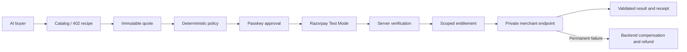

# Integrate a paid merchant service

MeterGate currently ships one real private merchant, OrbitIntel, with three products. This guide describes the implemented contract and the work needed to adapt it to another merchant. There is no published merchant SDK or self-service onboarding portal yet.

## Boundaries

The buyer sees catalog metadata, immutable quotes, policy decisions, a human approval URL, and scoped resource access. It never receives a merchant shared secret or Razorpay secret. MeterGate verifies captured payment before issuing an entitlement and again at the value-release boundary. The merchant handles its own digital resource and one logical execution per fulfillment key.



## 1. Define the product contract

Register a merchant and service with a stable slug/name, integer minor-unit price, currency, one-time purchase type, strict input/output JSON Schemas, JSON content type, fulfillment time bound, and refund-on-failure policy. For OrbitIntel, the input is `{"norad_id":25544}` and prices are 200, 500, and 900 paise.

The trusted `app.scripts.seed_dev` script configures the reference merchant. HTTP merchant/service POST and PATCH routes require the existing `admin` role, recent passkey authentication, allowed Origin, and CSRF token. An ordinary buyer or routine operator cannot administer the catalog. Do not put administration credentials in an agent.

Quote creation snapshots the product, input, price, and terms. Later product edits affect future quotes; they do not alter an already approved purchase.

## 2. Implement the private fulfillment endpoint

The implemented reference route is:

```http
POST /internal/v1/fulfillments/{fulfillment_execution_id}
Authorization: Bearer <server-to-server shared secret>
Content-Type: application/json
```

The request envelope contains exactly `service_id`, `service_slug`, `input`, and `input_hash`. The execution ID is in the path. IDs in the following example are placeholders; use the real values supplied by MeterGate:

```json
{
  "service_id": "svc_...",
  "service_slug": "orbital-risk-report",
  "input": {"norad_id": 25544},
  "input_hash": "sha256:..."
}
```

Authenticate before consuming the request body, bound body size, reject malformed/extra fields, and verify the RFC 8785 canonical input hash. The `ful_...` execution ID is the idempotency key. Persist the binding between that ID, service, and input; replay the same stored result for identical retries and reject a changed binding. Do not perform a new logical execution on a retry.

A successful JSON envelope contains exactly these fields:

```json
{
  "fulfillment_execution_id": "ful_...",
  "service_id": "svc_...",
  "input_hash": "sha256:...",
  "result_content_type": "application/json",
  "result": {"the": "actual purchased data matching the registered output schema"}
}
```

This is an envelope illustration, not a valid OrbitIntel report. MeterGate rejects mismatched IDs/hashes and results that do not satisfy the purchased output schema. It persists successful results with a canonical result hash before reporting fulfillment complete.

Implementation references: `apps/orbitintel/app/api/internal.py`, `apps/orbitintel/app/idempotency.py`, `apps/api/app/providers/fulfillment.py`, and `apps/api/app/services/fulfillments.py`.

## 3. Configure private transport

For the reference merchant, configure `ORBITINTEL_BASE_URL` and an independent `ORBITINTEL_SHARED_SECRET` on the trusted services. ServiceFulfillmentConfig stores each private endpoint, enabled state, timeout, retry bound, and revision. The seed script writes these records. Keep the merchant on loopback/private networking; do not publish its resource endpoint as an unprotected bypass.

The current application wires a transport using the OrbitIntel base URL and shared secret. An independent second merchant requires explicit provider/configuration wiring and independent credentials; creating a catalog row alone is insufficient. Preserve destination validation, bounded timeouts, secret separation, output validation, and the pinned retry destination when adding that wiring.

## 4. Exercise the buyer flow

1. POST the intended input to `/api/v1/resources/{merchant_slug}/{service_slug}/execute` without a bearer credential. Expect a machine-readable 402 purchase recipe.
2. Request the recipe's server quote, create a buyer policy, and evaluate it through REST or the narrow MCP tools.
3. Pause for human passkey approval and Razorpay Test Mode Checkout.
4. Poll the authoritative purchase status using the server's retry interval.
5. Obtain the scoped entitlement/capability and execute the exact purchased service and input.
6. Show the delivered report and download the purchase receipt. An exact later retry returns stored value, not a second execution.

## 5. Prove failure behavior

Test wrong input, quote tampering/expiry, policy rejection, invalid payment signatures, duplicate/out-of-order webhooks, capability expiry or wrong-resource binding, concurrent execution, merchant retry, invalid output, and permanent failure.

A paid permanent failure must release no resource. Deterministic compensation may request a full Test Mode refund when the purchased terms permit it. A provider response of `pending` is not completion; the final receipt/operator evidence must show trusted `processed` status before claiming recovery. Contradictory evidence enters review rather than being rewritten as success.

For demonstration only, OrbitIntel accepts development/test fault modes. Configure them privately before the failure recording, then restore normal operation. Do not expose a public fault or refund-control endpoint.
